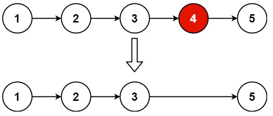

### 19. Remove Nth Node From End of List

**Problem**\
Given the head of a linked list, remove the nth node from the end of the list and return its head.

**Example 1:**\
\
Input: head = [1,2,3,4,5], n = 2\
Output: [1,2,3,5]

**Example 2:**\
Input: head = [1], n = 1\
Output: []

**Example 3:**\
Input: head = [1,2], n = 1\
Output: [1]

**Constraints:**
- The number of nodes in the list is sz.
- 1 <= sz <= 30
- 0 <= Node.val <= 100
- 1 <= n <= sz

Follow up: Could you do this in one pass?

### Solution, Javascript (two-pass)
```javascript
var removeNthFromEnd = function(head, n) {
    /* if the List has only one node */
    if (head.next == null) return null 

    /* Otherwise, determine the list's 'size' */
    let size = 2
    let prev = head
    let current = head.next
    while (current.next != null) {
        prev = current
        current = current.next
        size ++
    } 
    /* If we are removing the ultimate node */
    if (n == 1) {   
        prev.next = null

    /* Otherwise, go through list again and remove node */
    } else {
        const index = size - n
        /* If we are remove the first node */
        if (index == 0) {
            head = head.next
        /* Otherwise, we loop through until we get to the target index */
        } else {
            current = head
            for (let i = 1 ; i < index; i++ ){
                current = current.next 
            }
            current.next = current.next.next
        }
    }
    return head
};
```