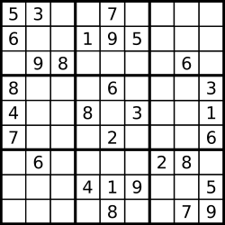

### 36. Valid Sudoku

**Problem**\
Determine if a 9 x 9 Sudoku board is valid. Only the filled cells need to be validated according to the following rules:

1. Each row must contain the digits `1-9` without repetition.
2. Each column must contain the digits `1-9` without repetition.
3. Each of the nine `3 x 3` sub-boxes of the grid must contain the digits `1-9` without repetition.
Note:
* A Sudoku board (partially filled) could be valid but is not necessarily solvable.
* Only the filled cells need to be validated according to the mentioned rules.
 

**Example 1:**\
\
Input: board = 
```
[["5","3",".",".","7",".",".",".","."]
,["6",".",".","1","9","5",".",".","."]
,[".","9","8",".",".",".",".","6","."]
,["8",".",".",".","6",".",".",".","3"]
,["4",".",".","8",".","3",".",".","1"]
,["7",".",".",".","2",".",".",".","6"]
,[".","6",".",".",".",".","2","8","."]
,[".",".",".","4","1","9",".",".","5"]
,[".",".",".",".","8",".",".","7","9"]]
```
Output: true

**Example 2:**\
Input: board = 
```
`[["8","3",".",".","7",".",".",".","."]
,["6",".",".","1","9","5",".",".","."]
,[".","9","8",".",".",".",".","6","."]
,["8",".",".",".","6",".",".",".","3"]
,["4",".",".","8",".","3",".",".","1"]
,["7",".",".",".","2",".",".",".","6"]
,[".","6",".",".",".",".","2","8","."]
,[".",".",".","4","1","9",".",".","5"]
,[".",".",".",".","8",".",".","7","9"]]
```
Output: false

Explanation: Same as Example 1, except with the 5 in the top left corner being modified to 8. Since there are two 8's in the top left 3x3 sub-box, it is invalid.

**Constraints:**
- board.length == 9
- board[i].length == 9
- board[i][j] is a digit 1-9 or '.'.

### Solution, Javascript (Hashset)
```javascript
/**
 * @param {character[][]} board
 * @return {boolean}
 */
var isValidSudoku = function(board) {
    const check = (xStart, yStart, type) => {
        const xEnd = type === "row" ? xStart + 9 : type === "box" ? xStart + 3 : xStart + 1
        const yEnd = type === "row" ? yStart + 1 : type === "box" ? yStart + 3 : yStart + 9
        const used = new Set()
        for (let i = xStart; i < xEnd ; i++) {
            for (let j = yStart; j < yEnd; j++){
                if( used.has(board[j][i])) return false
                if(board[j][i] !== ".") used.add(board[j][i])
            }
        }
        return true
    }
    for (let i = 0; i < 9; i++ ){
        if (check(0, i, "row") === false) return false
        if (check(i, 0, "column") === false ) return false 
    }
    for (let i = 0; i < 9; i += 3) {
        for (let j = 0; j < 9; j += 3){
            if(check(i,j,"box") === false ) return false
        }
    }
return true
}
```