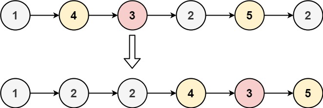

### 86. Partition List

**Problem**\
Given the `head` of a linked list and a value `x`, partition it such that all nodes less than `x` come before nodes greater than or equal to `x`.\
You should **preserve** the original relative order of the nodes in each of the two partitions.

**Example 1:**\
\
Input: head = [1,4,3,2,5,2], x = 3\
Output: [1,2,2,4,3,5]

**Example 2:**\
Input: head = [2,1], x = 2\
Output: [1,2]

**Constraints:**
- The number of nodes in the list is in the range [0, 200].
- -100 <= Node.val <= 100
- -200 <= x <= 200

### Solution, Javascript (2 pointer)
```javascript
/**
 * Definition for singly-linked list.
 * function ListNode(val, next) {
 *     this.val = (val===undefined ? 0 : val)
 *     this.next = (next===undefined ? null : next)
 * }
 */
/**
 * @param {ListNode} head
 * @param {number} x
 * @return {ListNode}
 */
var partition = function(head, x) {
    if (head === null || head.next === null ) return head // no work to be done
    let node = head
    let list1 = null
    let tail1 = null
    let list2 = null
    let tail2 = null
    while (node !== null) {
        const nextNode = node.next
        if (node.val >= x) {
            if (list2 ===  null) { 
                list2 = node // initialize list2
            } else {
                tail2.next = node // link prior tail node to this node
            }
            tail2 = node // now this node is the tail
            tail2.next = null // unlink this new tail node
        } else {
            if (list1 === null) {
                list1 = node
            } else {
                tail1.next = node
            }
            tail1 = node
            tail1.next = null
        }
        node = nextNode
    }
    if ( list1 === null ||list2 === null) {
        return head
    }
    tail1.next = list2
    return list1
};
```